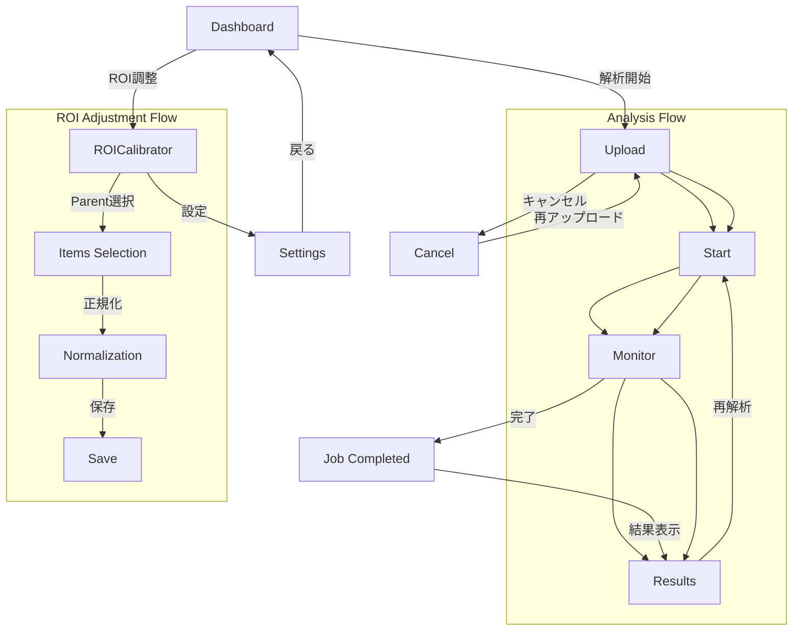

# FLOW-TRANSITION.md (動線とロジック)

---

## **User Flow (Mermaid)**

---

## **Interaction Logic**

### **ROI調整のステップ遷移**
- **Parent選択ステップ**  
  - ユーザーがROI調整対象のParentを選択 → `activeTarget`が更新 → プレビュー画像がデバウンスで取得（1秒遅延）。
  - 次のステップへ進むには「Next」ボタンをクリック → `step`が`items`に遷移。

- **Items選択ステップ**  
  - ROIアイテムのドラッグ＆ドロップで領域を設定 → `activeTarget`の座標が更新。
  - 「Back」ボタンでParent選択に戻る → `step`が`parent`に遷移。

- **正規化ステップ**  
  - ROI領域のスケーリング/回転調整 → `activeTarget`の変換パラメータが更新。
  - 「Save」ボタンクリック → `step`が`save`に遷移 → `roiStore`に保存処理をトリガー。

### **APIモードの切り替え挙動**
- **Liveモード**  
  - `apiMode: "live"` → 実際のAPIサーバーにリクエストを送信（`visionStore`の`uploadVideo`は実際のアップロード処理を実行）。
  - サーバーの応答が遅延がある場合、UIにローディングスピナーを表示。

- **Stubモード**  
  - `apiMode: "stub"` → モックデータを即時返却（`visionStore`の`uploadVideo`は擬似的な成功ステータスを返す）。
  - ユーザーがモードを切り替えると、`uiStore`の`apiMode`が更新 → 全コンポーネントに再レンダリングをトリガー。

### **SSEによるリアルタイム更新ロジック**
- **イベントタイプとUIへの影響**  
  - `progress`  
    - `visionStore.status`を`processing`に更新 → プログレスバーの進捗値を更新。
  - `capture_extracted`  
    - `visionStore`にキャプチャ画像を追加 → モニタ画面にリアルタイムで表示。
  - `talisman_analyzed`  
    - `visionStore`に解析結果を追加 → HUDに警告アイコンを表示（REQ-015）。
  - `job_completed`  
    - `visionStore.status`を`completed`に更新 → 「解析完了」メッセージを表示し、結果画面へ遷移。

- **SSE接続のライフサイクル**  
  - `startAnalysis`が呼び出されると、`listenToEvents`がSSE接続を確立。
  - エラーや切断が発生した場合、`visionStore.status`を`failed`に更新 → エラーメッセージを表示。

---

## **State Matrix**

| **イベントタイプ**       | **コンポーネント**       | **状態変化前**         | **状態変化後**         | **説明**                                                                 |
|-------------------------|--------------------------|------------------------|------------------------|--------------------------------------------------------------------------|
| ボタンクリック: Upload  | `visionStore`            | `idle`                | `pending`             | ビデオアップロード処理を開始 → プログレスバー表示                      |
| API受信: job_completed  | `visionStore`            | `processing`          | `completed`           | 解析が完了 → 結果画面へ遷移                                            |
| SSE受信: progress       | `visionStore`            | `pending`             | `processing`          | プログレスバーの進捗値を更新                                           |
| ボタンクリック: Next    | `roiStore`               | `parent`              | `items`               | ROI調整ステップを進める                                                |
| SSE受信: capture_extracted | `visionStore`         | `processing`          | `processing`          | キャプチャ画像をHUDにリアルタイム表示                                  |
| ボタンクリック: APIモード切り替え | `uiStore` | `live`                | `stub`                | モックデータモードに切り替える → 実際のAPI呼び出しを無効化             |
| SSE受信: talisman_analyzed | `visionStore`        | `processing`          | `processing`          | 解析結果の警告情報をHUDに表示（REQ-015）                               |
| サーバー接続監視: Polling | `App.tsx`              | `connected: false`    | `connected: true`     | サーバー接続状態をUIに反映                                             |
| ボタンクリック: サイドバー開閉 | `uiStore`           | `isSidebarCollapsed: true` | `isSidebarCollapsed: false` | サイドバーの表示/非表示を切り替える                                   |

---

## **補足